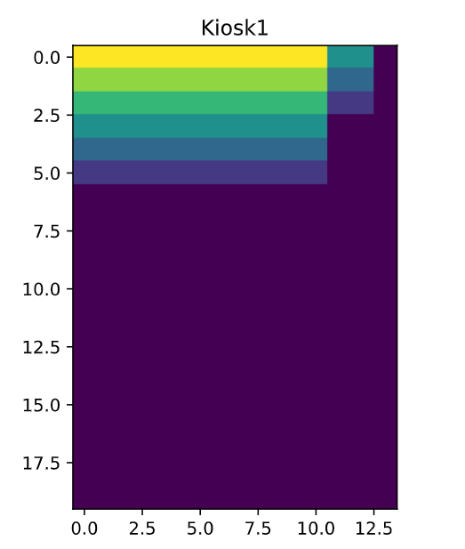

# 02465 Introduction to reinforcement learning and control theory

This repository contains code for 02465, introduction to machine learning and control theory. For installation instructions and course material please see:

 - https://www2.compute.dtu.dk/courses/02465/information/installation.html


## License
Some of the code in this repository is not written by me and the licensing terms are as indicated in the relevant files.

Files authored by me are only intended for educational purposes. Please do not re-distribute or publish this code without written permision from Tue Herlau (tuhe@dtu.dk)

## Updating packages

In case a package has been updated, please run: 

```
conda activate irlcenv
conda env update --file environment.yml --prune
```


# Kiosk

Problem 1 & 2:
- Creating classes: KioskEnvironment and KioskDPModel
- inserting probabilities for how many blasters are bought a day, 30%, 60% and 10%
- set state space to n=20
- set action space to 15
- define cost function: cost of buying is 1,5 credit, and overnight all inventory above 20 should be removed

Got figure: 
- this is the optimal policy
- x-axis is days from 0-14 and y-axis is how many items in stock
- if few items in stock, yellow/green color means order many items, whereas purple means order few/none, which can be seen in areas where stock is fuller
- as time runs out, the optimal policy also orders less aggressively as high stock has no value in the end of the horizon

The DP thereby:
- understands uncertainty in demand
- respects ordering cost
- avoids end-of-horizon waste